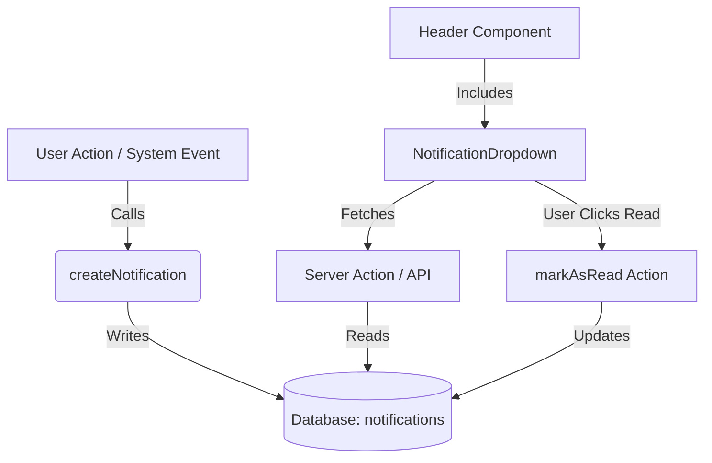

# Notification System Upgrade Guide

This document analyzes the current notification system and outlines the steps to upgrade it to a dropdown dialog box.

## Current System Overview

### 1. User Interface (UI)
-   **Location**: `src/app/(authenticated)/notifications/page.tsx`
-   **Type**: Full-page view.
-   **Data Source**: **Dummy Data** (`initialNotifications` array).
-   **Features**:
    -   Lists notifications with title, description, time, type (success/info/warning/error).
    -   Filter for "All" vs "Unread".
    -   "Mark as Read" and "Delete" buttons (local state only).
    -   Visual indicators (colors/icons) based on notification type.

### 2. Database Schema
-   **File**: `src/db/schemas/notifications.ts`
-   **Table**: `notifications`
-   **Columns**:
    -   `id`: UUID (Primary Key)
    -   `message`: Text
    -   `userId`: Text (Foreign Key to users)
    -   `createdAt`: Timestamp

### 3. Data Access Layer
-   **File**: `src/data-access/delegate/notifications.ts`
-   **Functions**:
    -   `createNotification(userId, message)`: Inserts a new row.
    -   `getNotifications(userId)`: Fetches all notifications for a user, ordered by newest first.
    -   `sendRegistrationNotification(userId, competitionId)`: Helper to send a specific message.

---

## Limitations

1.  **Data Disconnect**: The UI is currently completely disconnected from the Database. Code creating notifications (e.g., `sendRegistrationNotification`) writes to the DB, but the UI only shows hardcoded dummy items.
2.  **Schema Gaps**: The current database schema is missing critical fields used in the UI:
    -   **`read`**: To track if a user has seen the notification.
    -   **`title`**: To show a brief header.
    -   **`type`**: To enable the visual distinction (success/warning/etc.).
    -   **`link`** (Optional): To allow clicking a notification to navigate to a relevant page (e.g., a competition).
3.  **UX Friction**: Notifications are currently on a separate page, requiring navigation away from current work. A dropdown is standard for quick checks.
4.  **No Interactions**: "Mark as read" and "Delete" do not persist to the database.

---

## Upgrade Implementation Plan

To upgrade to a functional Dropdown Notification System, follow these steps:

### Phase 1: Database & Backend Updates

1.  **Update Schema** (`src/db/schemas/notifications.ts`):
    Add the missing columns to the `notifications` table.
    ```typescript
    export const notifications = pgTable("notifications", {
        // ... existing fields
        title: text("title"),
        type: text("type").default("info"), // 'info', 'success', 'warning', 'error'
        isRead: boolean("is_read").default(false).notNull(),
        link: text("link"), // URL to navigate to
        // ...
    });
    ```
    *Note: Run migration after modifying schema.*

2.  **Update Data Access** (`src/data-access/delegate/notifications.ts`):
    -   Modify `createNotification` to accept `title`, `type`, `link`.
    -   Add `markAsRead(notificationId)` function.
    -   Add `markAllAsRead(userId)` function.
    -   Add `deleteNotification(notificationId)` function.
    -   Update `getNotifications` to support pagination or limit (dropdowns usually show latest 5-10).

### Phase 2: Create Notification Component

Create a new component `src/components/notifications/notification-dropdown.tsx`.

1.  **Structure**:
    -   Use `DropdownMenu` from `src/components/ui/dropdown-menu.tsx` (similar to `src/components/user/dropdownmenu.tsx`).
    -   **Trigger**: A Bell icon (possibly with a red badge for unread count).
    -   **Content**:
        -   Header: "Notifications" title + "Mark all as read" button.
        -   Scrollable List: Map through fetched notifications.
        -   Empty State: "No new notifications".

2.  **Logic**:
    -   **Fetching**: Use a `useEffect` on mount to fetch notifications (or use a library like TanStack Query if available, otherwise a simple fetch to an API route or Server Action).
    -   **Real-time (Optional)**: For now, fetch on open or mount.
    -   **Interactions**: Clicking a notification should:
        -   Mark it as read (optimistic update).
        -   Navigate to `link` if present.

### Phase 3: Integration

1.  **Place in Header**:
    -   Open `src/components/ui/header-authenticated.tsx`.
    -   Import `NotificationDropdown`.
    -   Place it next to the `UserDropdown`.

2.  **Clean Up**:
    -   Remove or repurpose the old `/notifications` page (it can serve as a "View All" history page).

### Connection Diagram


